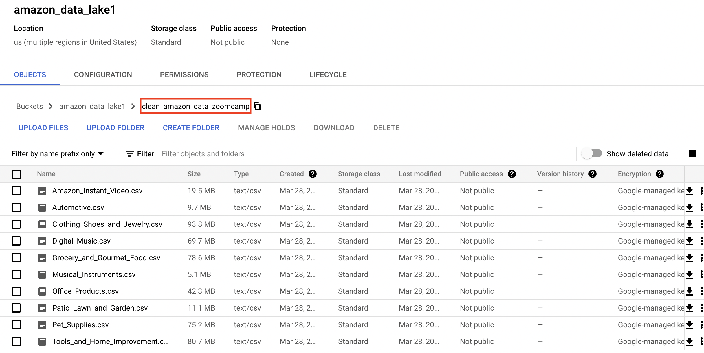
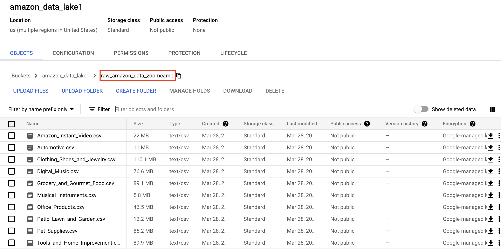
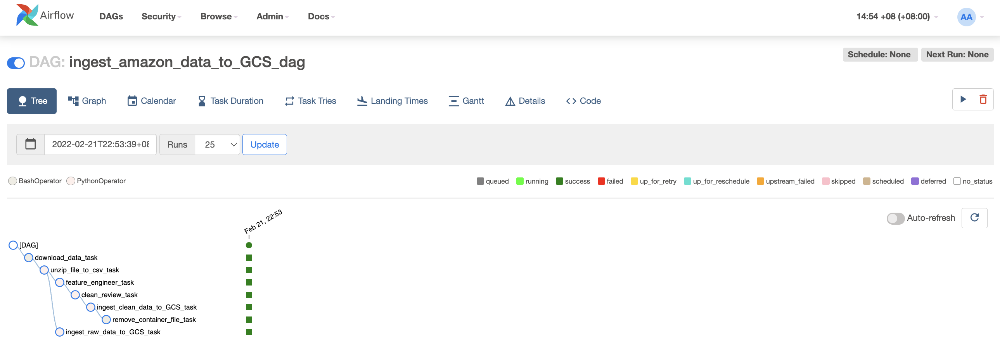
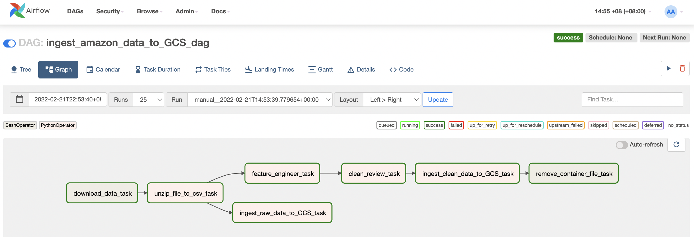
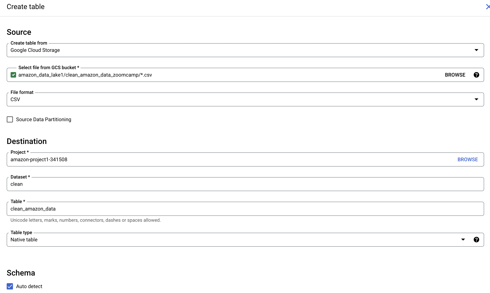
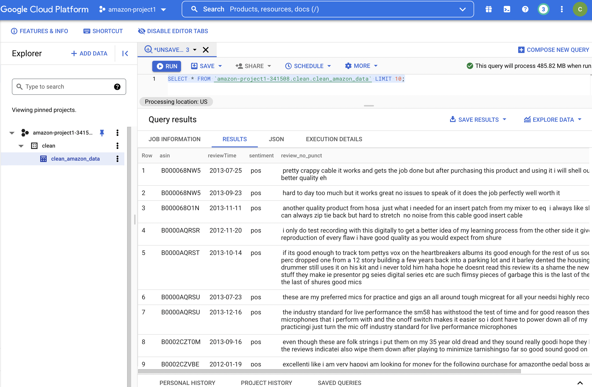
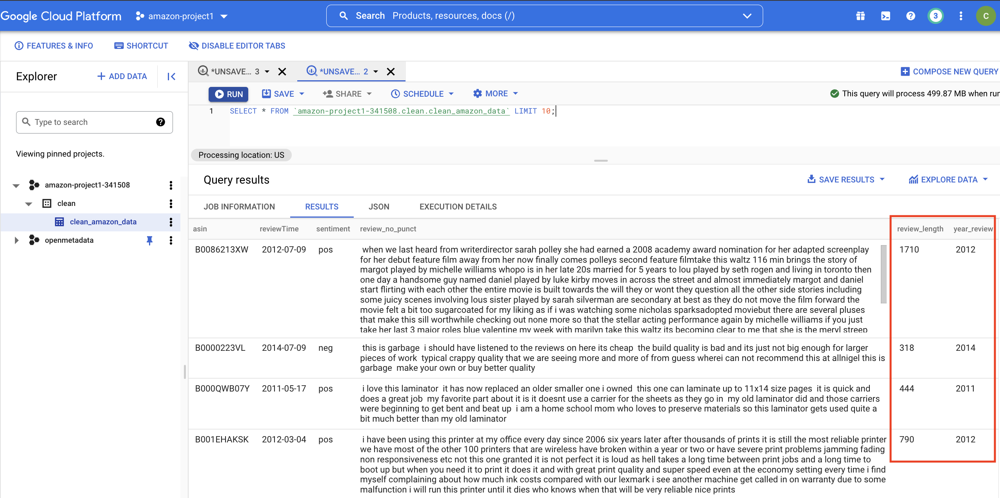
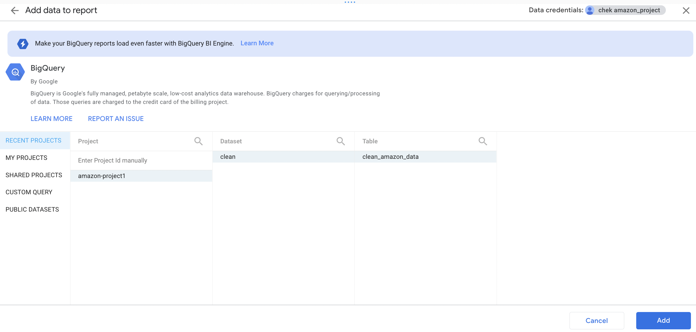
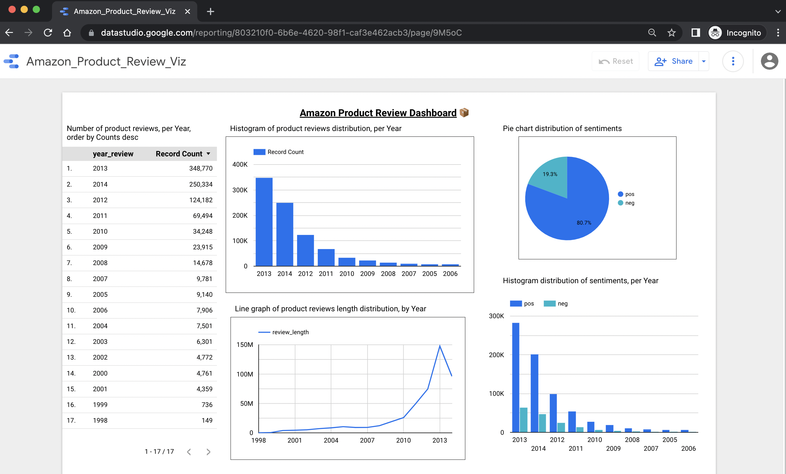

# Amazon Product Reviews Data Pipeline
## Project Objective
To create a simple data pipeline which aims to serve the following:
1. Automatically download 10 raw data files from [source](http://jmcauley.ucsd.edu/data/amazon/) 
2. Unzip the data files and convert them into `.csv` format
3. Perform data cleaning on the data files
4. Ingest both cleaned and raw data files into Google Cloud Storage


End state of the data pipeline would be  `.csv` files ready for ML pipeline to extract as `pandas.Dataframe`, which subsequently performs NLP (Natural Language Processing) techniques on the data. The ML pipeline portion of the project will not be covered in this git repository. 

## Motivation
The idea stemmed from a ML project which I was working on - An end-to-end ML pipeline that aims to classify positive
and negative reviews from the customers over different Amazon products.

Back then, the data files were downloaded manually from [source](http://jmcauley.ucsd.edu/data/amazon/) and the data was cleaned by running Python codes within a [jupyter notebook](https://colab.research.google.com/drive/1-c-mHcUU_sWQgZu3o9s0MCpdeexeqWQC?usp=sharing). The cleaned data files were then fed into the ML pipeline for training. There was also no usage of a data warehouse.

Hence, it sparked the idea of creating a data pipeline which can automate the entire flow. The aim is to prepare the data files such that they are 100% ready to flow into ML pipeline. 

## Data
Raw data is available on the [source website](http://jmcauley.ucsd.edu/data/amazon/). 

Data consists of product reviews written by buyers who have purchases items from Amazon online store. The products are categorised into different product genre. Eg. Clothing, Shoes and Jewelry, Office Products, Musical Instruments etc. Each data file consists of product reviews from the same category.

The raw data downloaded is a `.gz` format, and after running below, a `.json` file is unzipped. 

```shell
gunzip --keep {reviews_Clothing_Shoes_and_Jewelry_5.json.gz}
```

Below is a snippet on how to extract data from `.gz` to `pandas.Dataframe` conveniently. 

```python
import pandas as pd
import gzip

def parse(path):
  g = gzip.open(path, 'rb')
  for l in g:
    yield eval(l)

def get_dataframe(path):
  i = 0
  df = {}
  for d in parse(path):
    df[i] = d
    i += 1
  return pd.DataFrame.from_dict(df, orient='index')

df = get_dataframe('reviews_Clothing_Shoes_and_Jewelry_5.json.gz')
```

A sample row of record from a `pandas.Dataframe` as below:
| reviewerID     | asin       | reviewerName | helpful  | reviewText                                        | overall | summary | unixReviewTime | reviewTime  |
| -------------- | ---------- | ------------ | -------- | ------------------------------------------------- | ------- | ------- | -------------- | ----------- |
| A14VAT5EAX3D9S | 1384719342 | Jake         | [13, 14] | The product does exactly as it should and is q... | 5       | Jake    | 1363392000     | 03 16, 2013 |

As you can see, only certain features will most likely be relevant to the ML pipeline in order to classify whether, or not, is a product review Positive / Negative - `reviewText`, `overall`.

To analyse further, below is one of the positive product reviews we are working on:
> Wonder my niece wears it every single day, yellow is her favorite color right now an this cute little tutu made he da. It is well built and we hope she gets lots of wear out of it.


# Workflow Orchestration
Apache Airflow is a workflow engine that will easily schedule and run complex data pipelines. It will make sure that each task of the data pipeline will get executed in the correct order and time, and each task gets the required resources.
In Apache Airflow, there are several tasks within the `ingest_amazon_data_GCS.py` dag.

1. download_data
2. unzip_file_to_csv
3. feature_engineer
4. clean_review
5. ingest_clean_data_to_GCS
6. remove_local_file
7. ingest_raw_data_to_GCS

## download_data
This is the first task of the data pipeline. As the name suggests, this task is responsible for downloading the raw files from [source](http://jmcauley.ucsd.edu/data/amazon/). Depending on the size of the individual raw files, the time takes to download each file varies. The task will first read `download_url.txt`, and based on the URLs present in the text file, it will proceed to download and save them into the docker container. 

*Estimated time for this Airflow task to succeed: ~* ***2 mins*** (subject to internet speed)

## unzip_file_to_csv
This is the second task of the data pipeline. This task is in-charged of unzipping the `.gz` files, extract the `.json` and lastly, converting them to `.csv` files.

Once the file(s) have been downloaded and unzipped, we can see them sitting within our docker container via below commands:
```bash
# to find out container ID for worker container
docker ps 

# to ssh into the worker container
docker exec -it [worker_container_id] bash

# to list all the files within the container
ls -lrth
```

After performing `ls -lrth`, we can see that below are some of the files downloaded. We can see both `.gz` and `.csv` format within the container:

```bash
airflow@ede05540312a:/opt/airflow$ ls -lrth
total 94M
-rw-r--r-- 1 root    root   39 Feb 21 08:48 requirements.txt
drwxr-xr-x 2 airflow root   64 Feb 21 08:49 plugins
drwxr-xr-x 7 root    root  224 Feb 21 13:08 logs
drwxr-xr-x 8 airflow root  256 Mar 28 03:01 dags
-rw-rw-r-- 1 airflow root  43K Mar 28 05:13 airflow.cfg
-rw-rw-r-- 1 airflow root 4.6K Mar 28 05:13 webserver_config.py
-rw-r--r-- 1 airflow root    2 Mar 28 05:15 airflow-worker.pid
-rw-rw-r-- 1 airflow root 4.5M Mar 28 05:24 reviews_Automotive_5.json.gz
-rw-rw-r-- 1 airflow root 4.8M Mar 28 05:24 reviews_Patio_Lawn_and_Garden_5.json.gz
-rw-rw-r-- 1 airflow root 2.4M Mar 28 05:24 reviews_Musical_Instruments_5.json.gz
-rw-rw-r-- 1 airflow root 9.1M Mar 28 05:24 reviews_Amazon_Instant_Video_5.json.gz
-rw-rw-r-- 1 airflow root  21M Mar 28 05:25 reviews_Amazon_Instant_Video_5.json.gz.csv
-rw-rw-r-- 1 airflow root  20M Mar 28 05:26 reviews_Automotive_5.json.gz.csv
-rw-rw-r-- 1 airflow root  23M Mar 28 05:26 reviews_Patio_Lawn_and_Garden_5.json.gz.csv
-rw-rw-r-- 1 airflow root  11M Mar 28 05:26 reviews_Musical_Instruments_5.json.gz.csv
```

*Estimated time for this Airflow task to succeed: ~* ***3 mins***

## feature_engineer
This is the third task of the data pipeline. This task will help to 
- drop features that are not relevant to the ML pipeline for training
- create `reviewTime` feature to tell when a review was submitted by a buyer
- create `review` feature, which simply combines `reviewText` and `summary` together into one feature 
- create `sentiment` feature, which bins `overall` ratings into either `pos` or `neg`. `sentiment` will serve as the target feature for the ML pipeline
- create `reviewText_len` feature, and based on this value, we will then drop `reviewText_len=0` records, which suggests that this particular record does not have any product reviews.

*Estimated time for this Airflow task to succeed: ~* ***5 mins*** 

## clean_review
This is the fourth task of the data pipeline. This task will do two things:
- drop record with NA for `review` feature
- convert all `review` text to lower case, and dropping all punctuation marks

*Estimated time for this Airflow task to succeed: ~* ***15 mins***

## ingest_clean_data_to_GCS
This is the fifth task of the data pipeline. As the name suggests, this task is responsible for uploading all the clean data files to Google Cloud Storage. Once this task is completed, we can go to our GCS bucket on Googe console, and we will see the files present as below:

GCS Bucket for clean data


GCS Bucket for raw data



*Estimated time for this Airflow task to succeed: ~* ***1 min***

## remove_local_file
This is the sixth task of the data pipeline. It is a good practice to perform some housekeeping once the data pipeline is almost completed. As such, this task will delete all the files from the container after they have been successfully uploaded onto GCS bucket. Once this task completes, we should see no data files inside our container as below:

*Estimated time for this Airflow task to succeed: ~* ***Few seconds***

```bash
airflow@ede05540312a:/opt/airflow$ ls -lrth
total 60K
-rw-r--r-- 1 root    root   39 Feb 21 08:48 requirements.txt
drwxr-xr-x 2 airflow root   64 Feb 21 08:49 plugins
drwxr-xr-x 7 root    root  224 Feb 21 13:08 logs
-rw-rw-r-- 1 airflow root  43K Mar 28 05:13 airflow.cfg
-rw-rw-r-- 1 airflow root 4.6K Mar 28 05:13 webserver_config.py
-rw-r--r-- 1 airflow root    2 Mar 28 05:15 airflow-worker.pid
drwxr-xr-x 8 airflow root  256 Mar 28 06:09 dags
```

## ingest_raw_data_to_GCS
This is the seventh and last task of the data pipeline. Note that this task has no dependencing on most of the previous tasks. The only dependency this tasks has is task `unzip_file_to_csv_task`. This task simply uploads the raw `.csv` files after unzipping is done. Once this task is completed, we can go to our GCS bucket, and we will see the files present as below:

*Estimated time for this Airflow task to succeed: ~ ***1 min*** (subject to internet speed)

# End State for Airflow Orchestration
The end state is to flow both cleaned and raw sets of `.csv` data files into the data warehouse, which is GCS bucket as seen below:

## Airflow

Airflow Tree



Airflow Graph



# Creating Tables in Data Warehouse
Now that we have ingested all our data (both clean and raw) into Google Cloud Storage, we can create tables in BigQuery. 

1. Go to BigQuery in Google Console, select the appropriate project. 
2. Create a new dataset 
3. Within the empty dataset, create a new table by selecting below configurations:




4. After around 2-3 mins, the table with all of our cleaned data should be created. Here, we have `clean_amazon_data` table created which consists of product reviews from all 10 categories.  

Below is a sample query which shows 10 records of our table created: 
```sql
SELECT * FROM `amazon-project1-341508.clean.clean_amazon_data` LIMIT 10;
```



More details on creating tables in BigQuery can be here by the [offical Google doc](https://cloud.google.com/bigquery/external-data-cloud-storage#creating_and_querying_a_permanent_external_table)

# Data Transformation in Data Warehouse
## Creating review_length column
The first transformation we will be doing is to create a `review_length` column through BigQuery console. This column will tell us how long/short each product review will be. 

Below are the SQL commands we will be running:

```sql
--To create a new empty column in the existing table called 'review_length'

ALTER TABLE `amazon-project1-341508.clean.clean_amazon_data` ADD COLUMN `review_length` INTEGER;
```

```sql
--To update the newly created column 

UPDATE `amazon-project1-341508.clean.clean_amazon_data` SET review_length = LENGTH(review_no_punct)
WHERE LENGTH(review_no_punct) != 0;
```

## Creating year column
The second transformation we will be doing is to create a `year` column through BigQuery console. This column will tell us which year the product review was submitted by the buyer. 

```sql
--To create a new empty column in the existing table called 'review_year'

ALTER TABLE `amazon-project1-341508.clean.clean_amazon_data` ADD COLUMN `year_review` INTEGER;
```

```sql
--To update the newly created column by extract year from the existing 'reviewTime' column

UPDATE `amazon-project1-341508.clean.clean_amazon_data` SET year_review = EXTRACT(YEAR FROM reviewTime)
WHERE LENGTH(review_no_punct) != 0;
```

## End State for Data Warehouse Transformation
We can see that two new columns have been created:
- review_length
- year_review



# Google Data Studio
Here, we use Google Data Studio to create some simple visusalisation of the data we have ingested by Airflow, and transformed in BigQuery. 

We will first connect our data source by selecting BigQuery, and the correct dataset and table.



The pdf version of the dashboard can be in the parent directory of this git repository `Amazon_Product_Review_Viz.pdf`

The URL for the dashboard can be found [here](https://datastudio.google.com/reporting/803210f0-6b6e-4620-98f1-caf3e462acb3). Please feel free to access the dashboard on Google Data Studio and play around with the interactive charts. If the dashboard is unavailable due to permission issue, please reach me here: chekweichia@gmail.com

Below is a screenshot of the dashboard created. 



# Reproduce
To run the entire data pipeline, we require few things:
1. `docker-compose.yaml`
2. GCP credential file 
3. Create a Google Cloud project
3b. Within the project, create a Google Cloud Storage bucket

## Setting up Airflow
1. Build the image (only first-time, or when there's any change in the Dockerfile, takes ~15 mins for the first-time):

```bash
docker-compose build
```

2. Initialize the Airflow scheduler, DB, and other config

```bash
docker-compose up airflow-init
```
3. Kick up the all the services from the container:

```bash
docker-compose up
```

Once all the containers are up and healthy, we can access Airflow web browser UI via  `localhost:8080` with default login credential: airflow/airflow. 

For more information on starting up Airflow via docker, as well as info regarding GCP credentials, please visit [Notes by Alvaro Navas](https://github.com/ziritrion/dataeng-zoomcamp/blob/main/notes/2_data_ingestion.md#setting-up-airflow-with-docker).


# Trouble Shooting
## Long running Airflow task
1. In the event that the Airflow task is running too long for comfort, please visit the logs of each task and see what is going on. I have sprinkled `logging.info` among the codes to allow users to track how the code is executing. 

Eg. `clean_review_task` is one of the tasks that takes more than 5 mins to succeed. We can view the logs in Airflow and as we can see, the task has succeeded cleaning up for most files and it is currently cleaning up `reviews_Tools_and_Home_Improvement_5.json.gz.csv`. Hence, we know that the task is running fine and it is not in hang state.

```
...
...
...
[2022-03-28, 14:38:06 +08] {clean_reviews.py:19} INFO - running clean review for /opt/***/reviews_Digital_Music_5.json.gz.csv...
[2022-03-28, 14:40:12 +08] {clean_reviews.py:16} INFO - before dropping na for /opt/***/reviews_Tools_and_Home_Improvement_5.json.gz.csv...(134476, 6)
[2022-03-28, 14:40:13 +08] {clean_reviews.py:18} INFO - after dropping na for /opt/***/reviews_Tools_and_Home_Improvement_5.json.gz.csv...(134413, 6)
[2022-03-28, 14:40:13 +08] {clean_reviews.py:19} INFO - running clean review for /opt/***/reviews_Tools_and_Home_Improvement_5.json.gz.csv...
...
```

## Entire Airflow Dag takes too long to complete
Currently, the data pipeline aims to automatically download and ingest 10 categories of Amazon products from the [raw data source](http://jmcauley.ucsd.edu/data/amazon/). In the event that the entire data pipeline takes too long to complete, please feel free to reduce the number of URLs to either 2 or 3. This will reduce the total time significantly as we are now downloading and processing few categories of products.


# Resources
1. [Jupyer Notebook for EDA, manual data preprocessing and cleaning](https://colab.research.google.com/drive/1-c-mHcUU_sWQgZu3o9s0MCpdeexeqWQC?usp=sharing)
2. [Raw data source](http://jmcauley.ucsd.edu/data/amazon/)
3. [Notes by Alvaro Navas](https://github.com/ziritrion/dataeng-zoomcamp/blob/main/notes/2_data_ingestion.md#setting-up-airflow-with-docker)


# Credits
1. Data Engineer Zoomcamp by DataTalks Club
2. Alvaro Navas for notes